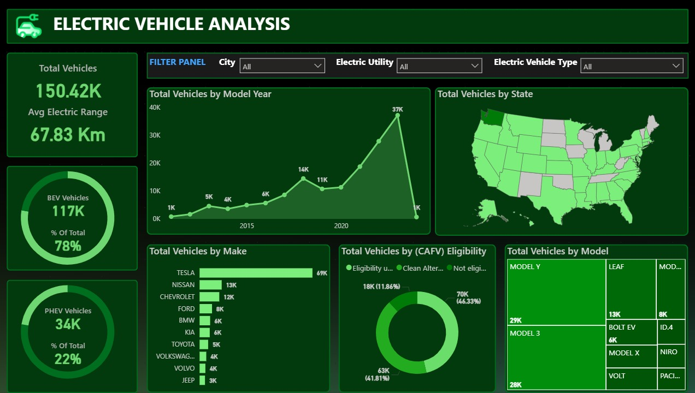

# 🚗 Electric Vehicle Population - Power BI Dashboard

📈 This project presents a detailed **Power BI dashboard** that analyzes the population and distribution of **electric vehicles (EVs)** across various U.S. states.

It provides insights into vehicle types, top EV brands, and regional adoption trends, all through an interactive and engaging report.

---

## 📁 Files Included

| File Name                          | Description                                          |
|-----------------------------------|------------------------------------------------------|
| `DASHBOARD.pbix`                  | Final Power BI report and dashboard                 |
| `Electric_Vehicle_Population_Data.rar` | Compressed dataset used in the report               |
| `DASHBOARD.jpg`                   | Screenshot of the completed dashboard                 |
| `Background.jpg`                  | Custom background image used in the dashboard       |
| `Electric Vehicle Presentation.pptx` | Project summary presentation                        |

---

## 📊 Dashboard Features

- 📌 Total EVs by **state**, **make**, and **model**
- 📌 Visualizations: **Maps**, **Bar charts**, **Tree maps**, and KPIs
- 📌 Slicers for filtering by region, vehicle type, and model year
- 📌 Highlights EV growth trends and adoption across states

---

## 🛠 Tools & Techniques Used

| Tool        | Use Case                                      |
|-------------|-----------------------------------------------|
| 🟣 Power BI | Data modeling, DAX calculations, and visuals   |
| 🧹 Data Prep | Cleaned and structured data inside Power BI    |
|  Maps      | Geo-visualization of regional EV population   |
| 📊 Charts    | Comparative analysis of EV brands & types      |
| 🎨 Design    | Custom background and theme for visuals        |

---

## 🔍 Key Insights

✅ Identified the **most popular EV makes and models**  
✅ Visualized **EV distribution** across U.S. states  
✅ Showcased **growth trends** by year and region  
✅ Delivered an **easy-to-navigate dashboard** with deep insights

---

## 📌 Purpose of the Project

> 🎓 This project was created as part of my **Power BI learning journey**, focusing on real-world data visualization and storytelling.  
> It highlights my skills in data modeling, dashboard design, and analytical thinking.

---

##  About Me

I'm **Omar Nasr**, an aspiring Data Analyst passionate about extracting insights from data using Excel, SQL, Python, and Power BI.  
Check out more of my projects on [GitHub](https://github.com/YOUR_USERNAME) 🔗

---

 If you found this project interesting, don't forget to give it a **star**!
